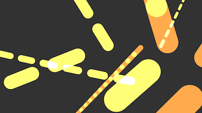

#p5js-simple-particles

A simple p5js learning experiment using various colours and blend modes to draw particles the canvas.

[There's a demo running here](https://nbogie.github.io/p5js-simple-particles/)

You can also find old version of this at http://codepen.io/enz0/pen/yOobpQ.

###Controls

    ,: change to previous favourite config and respawn
    .: change to next favourite config and respawn

    Mouse-Click: respawn particles at mouse, keeping same colour palette

    0-9: change blend mode (impermanent)

    f: toggle whether configs are picked from favourites 
         or generated at random.

    b: give a velocity "Bump" to the particles

    l: reload favourites (and pick one at random)
    p: pause the simulation
    d: toggle debug
    r: report the colour palette currently in use (to console)

### Screenshots

